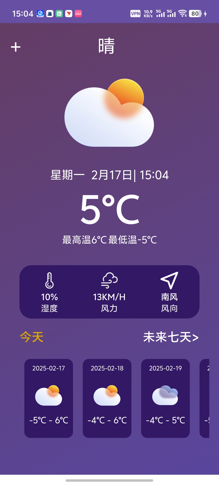
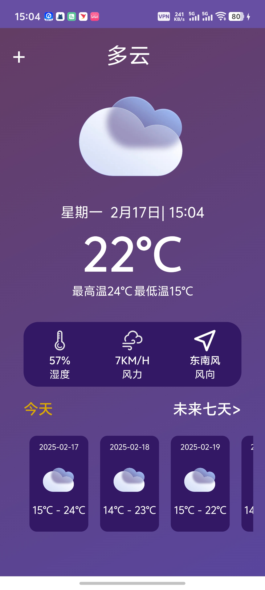
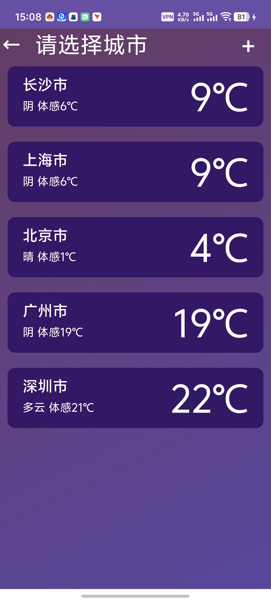
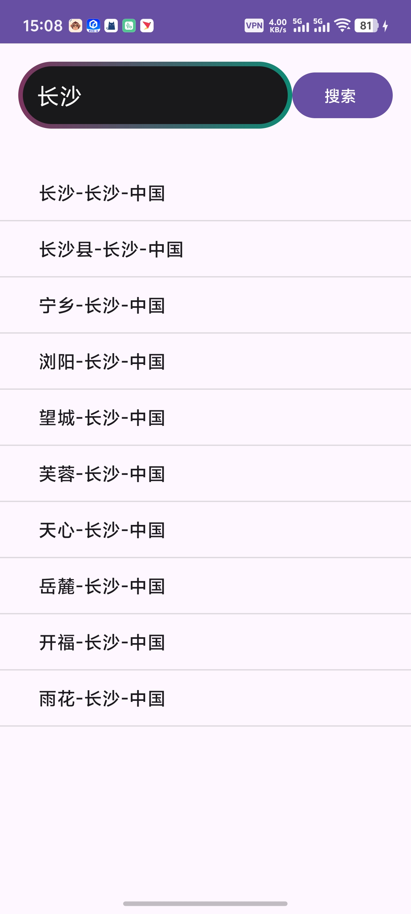

# 寒假考核
## App介绍
我的寒假考核写的主要还是一个简化版的天气APP,界面参考的主要也是各大手机厂商所做的系统天气APP,虽然这玩意看起来很简单(可能也确实简单),但是还是花费了另外我不少的时间,也明白了自己确实实力和基础都不太扎实,其中的网络请求JSON使用的是GSON来解析,使用了ItemTouchHelper这个特别的辅助类实现现触摸交互效果，尤其是滑动和拖拽操作.
## 设计思路
### 主页面
#### 天气图标随天气种类的改变而改变
#### 晴天

#### 阴天

还有很多我就不多展示了
### 选择页面
#### 长按可以改变控件的位置

### 搜索页面
#### 输入城市可以返回相对应城市列表

根据输入的城市可以返回相对应的id信息到数据库中,进而更新rv,实现添加城市的功能
### 使用上
#### (1)项目初始化了五个城市,点击不同的城市控件,可以跳转到不同的天气页面
#### (2)长按城市可以对控件进行位置的调换,向左滑动可以删除
#### (3)在添加城市页面,可以进行模糊搜索,以及城市的添加
## 使用的技术
#### 用的语言是java
#### gson解析数据
#### 使用了ItemTouchHelper这个特别的辅助类实现现触摸交互效果，尤其是滑动和拖拽操作
#### 数据库使用的为SQLite
## 心得体会
一个月的时间，但我独立开发出了一款属于自己的APP。这对于没有上大学之前的我来说，几乎是无法想象的事情。回想起刚进入大学时，我站在人生的十字路口，面对未来的迷茫和不确定性，内心充满了焦虑和不安。然而，正是这段经历让我深刻体会到，成长往往始于挑战，而突破则源于坚持。

在项目的开发过程中，我遇到了许多困难，比如技术上的瓶颈、逻辑上的混乱，甚至是心态上的波动。但幸运的是，我并不是一个人在战斗。学长们无私地给予了我许多帮助和指导，他们牺牲了自己的周末时间，耐心地为我们讲解技术细节，分享他们的开发经验，甚至在我遇到问题时，第一时间给予解答和支持。正是他们的帮助，让我少走了许多弯路，也让我更加坚定了前行的信心。

通过这次项目开发，我不仅学到了许多实用的技术知识，比如Android开发的基础框架、网络请求的处理、数据的解析与展示等，更重要的是，我学会了如何面对问题、解决问题。每一次调试代码、每一次修复Bug，都是一次自我提升的机会。我逐渐意识到，编程不仅仅是写代码，更是一种逻辑思维和问题解决能力的锻炼。

此外，我也深刻体会到团队合作的重要性。虽然这次项目是我独立完成的，但在与学长们的交流中，我感受到了分享与协作的力量。他们的经验和建议让我受益匪浅，也让我明白，在未来的学习和工作中，与他人的沟通与合作是不可或缺的。

回顾这一个月的经历，我从最初的迷茫和不安，到如今的自信与坚定，这段旅程让我更加清晰地认识到自己的潜力。虽然项目还有很多可以改进的地方，但这次经历无疑是我大学生活中的一个重要里程碑。它让我明白，只要敢于尝试、勇于坚持，就一定能够突破自我，实现曾经认为不可能的目标。

未来，我会继续努力，不断学习和提升自己。同时，我也希望能够像学长们一样，将这份帮助与温暖传递下去，为更多的人提供支持与鼓励。感谢这段经历，感谢学长们的指导，也感谢那个没有放弃的自己。
